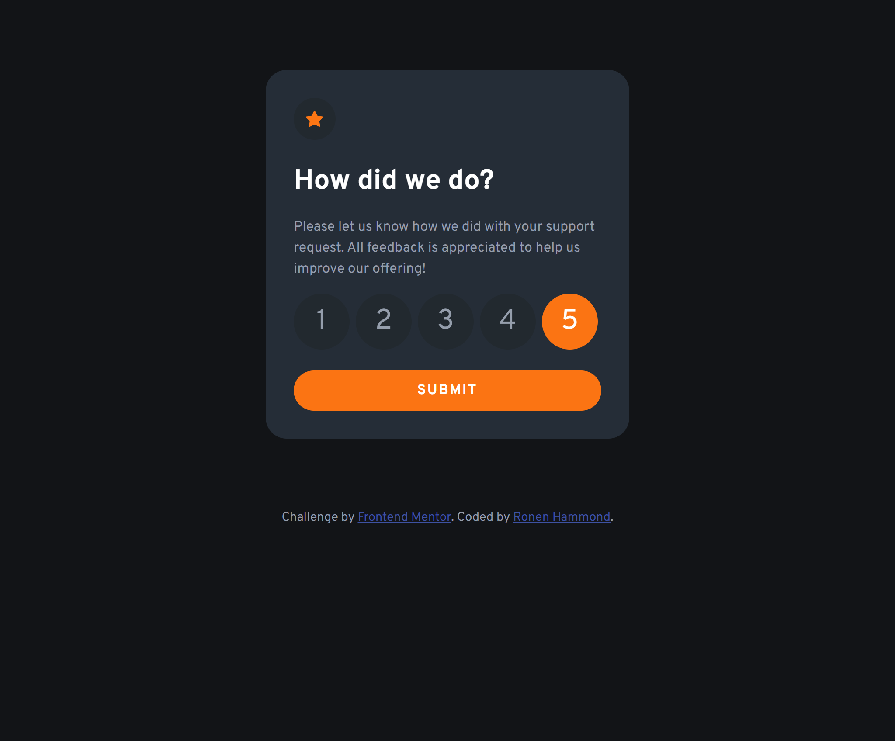
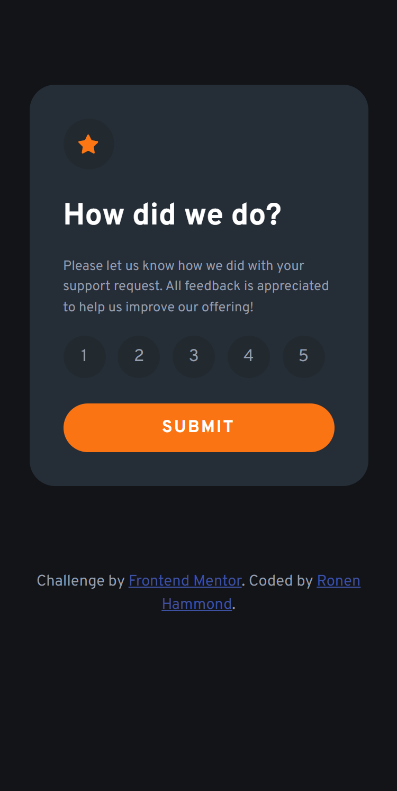

# Frontend Mentor - Interactive rating component solution

This is a solution to the [Interactive rating component challenge on Frontend Mentor](https://www.frontendmentor.io/challenges/interactive-rating-component-koxpeBUmI). Frontend Mentor challenges help you improve your coding skills by building realistic projects. 

## Table of contents

- [Frontend Mentor - Interactive rating component solution](#frontend-mentor---interactive-rating-component-solution)
  - [Table of contents](#table-of-contents)
  - [Overview](#overview)
    - [The challenge](#the-challenge)
    - [Screenshot](#screenshot)
    - [Links](#links)
  - [My process](#my-process)
    - [Built with](#built-with)
    - [What I learned](#what-i-learned)
  - [Author](#author)

## Overview

### The challenge

Users should be able to:

- View the optimal layout for the app depending on their device's screen size
- See hover states for all interactive elements on the page
- Select and submit a number rating
- See the "Thank you" card state after submitting a rating

### Screenshot

### Links

- Solution URL: [Solution URL](https://www.frontendmentor.io/solutions/interactive-rating-page-using-html-css-and-javascript-XhIrAMmIDs)
- Live Site URL: [Live Site](https://unique-sprinkles-8ea417.netlify.app/)

## My process

### Built with

- Semantic HTML5 markup
- CSS custom properties
- Flexbox
- Mobile-first workflow

### What I learned

Had the experience to practice more with the DOM.

## Author

- Website - [Ronen Hammond](https://www.ronenhammond.me)
- Frontend Mentor - [@RonenTGreat](https://www.frontendmentor.io/profile/RonenTGreat)
- Twitter - [@Ronen_T_G](https://www.twitter.com/Ronen_T_G)
- LinkedIn - [Ronen Hammond](https://www.linkedin.com/in/ronen-hammond/)
